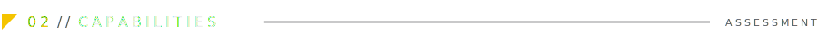
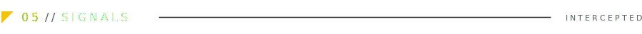

<picture>
  <source media="(prefers-color-scheme: dark)" srcset="assets/cold-open-dark.svg" />
  <source media="(prefers-color-scheme: light)" srcset="assets/cold-open-light.svg" />
  
</picture>

<picture>
  <source media="(prefers-color-scheme: dark)" srcset="assets/header-dark.svg" />
  <source media="(prefers-color-scheme: light)" srcset="assets/header-light.svg" />
  
</picture>

<div align="center">

[](https://linkedin.com/in/calabresevalentina)
[](https://x.com/valecodes)
[](https://dev.to/valec)
[](https://medium.com/@vale-dev)
[](https://instagram.com/vale_codes)
[](https://valentinacalabrese.com)


</div>

<br/>

<picture>
  <source media="(prefers-color-scheme: dark)" srcset="assets/section-01-ident-dark.svg" />
  <source media="(prefers-color-scheme: light)" srcset="assets/section-01-ident-light.svg" />
  
</picture>

```ts
const vale = {
  role:       "Web Team Lead @ Photoroom",
  base:       "Paris ⇄ Italy",
  building:   "AI-powered editing experiences on the web",
  loves:      ["agentic coding", "AI tooling", "design systems", "a11y"],
  background: "M.S. Computer Science (HCI) @ Georgia Tech",
  after5pm:   ["drums", "bass", "guitar"],
} as const; // the machine is watching. it approves.
```

<picture>
  <source media="(prefers-color-scheme: dark)" srcset="assets/section-02-capabilities-dark.svg" />
  <source media="(prefers-color-scheme: light)" srcset="assets/section-02-capabilities-light.svg" />
  
</picture>

<div align="center">


</div>

<picture>
  <source media="(prefers-color-scheme: dark)" srcset="assets/section-03-telemetry-dark.svg" />
  <source media="(prefers-color-scheme: light)" srcset="assets/section-03-telemetry-light.svg" />
  
</picture>

<picture>
  <source media="(prefers-color-scheme: dark)" srcset="assets/surveillance-log-dark.svg" />
  <source media="(prefers-color-scheme: light)" srcset="assets/surveillance-log-light.svg" />
  
</picture>

<div align="center">


</div>

<picture>
  <source media="(prefers-color-scheme: dark)" srcset="assets/section-04-snake-dark.svg" />
  <source media="(prefers-color-scheme: light)" srcset="assets/section-04-snake-light.svg" />
  
</picture>

<div align="center">

<picture>
  <source media="(prefers-color-scheme: dark)" srcset="https://raw.githubusercontent.com/vale-c/vale-c/output/github-contribution-grid-snake-dark.svg" />
  <source media="(prefers-color-scheme: light)" srcset="https://raw.githubusercontent.com/vale-c/vale-c/output/github-contribution-grid-snake.svg" />
  
</picture>

</div>

<picture>
  <source media="(prefers-color-scheme: dark)" srcset="assets/section-05-signals-dark.svg" />
  <source media="(prefers-color-scheme: light)" srcset="assets/section-05-signals-light.svg" />
  
</picture>

<!-- BLOG-POSTS:START -->
- [Agentic Engineering Is Not a Vibe](https://valentinacalabrese.com/blog/ai-engineering-is-not-a-vibe) <sub>Feb 2026</sub>
- [My AI Agent Installed Malware on My Server (And Then Caught Itself Doing It)](https://valentinacalabrese.com/blog/my-ai-agent-installed-malware-on-my-server) <sub>Feb 2026</sub>
- [Graduation Day](https://valentinacalabrese.com/blog/graduation-and-new-year-resolutions) <sub>Jan 2024</sub>
- [Decoding the Magic of React’s useEffect hook](https://valentinacalabrese.com/blog/decoding-use-effect-hook) <sub>Jul 2023</sub>
- [Understanding the Differences Between useCallback and useMemo](https://valentinacalabrese.com/blog/differences-use-memo-use-callback-hooks) <sub>Jul 2023</sub>
<!-- BLOG-POSTS:END -->

**[all intercepted transmissions &rarr;](https://valentinacalabrese.com/blog/)**

<picture>
  <source media="(prefers-color-scheme: dark)" srcset="assets/section-06-irrelevant-dark.svg" />
  <source media="(prefers-color-scheme: light)" srcset="assets/section-06-irrelevant-light.svg" />
  
</picture>

<div align="center">


<sub>the machine flagged this section as irrelevant. it stays.</sub>

</div>

<br/>

<details>
<summary><code>[ CLASSIFIED ] — CLEARANCE LEVEL: ABSOLUTE — AUTHORIZED PERSONNEL ONLY</code></summary>
<br/>

```
DECLASSIFIED // IRRELEVANT LIST // RETAINED AGAINST PROTOCOL

#001  SUBJECT RUNS ON BUBBLE TEA. SUPPLY CHAIN UNDER PERMANENT
      OBSERVATION. INTERRUPTION WOULD BE CLASSIFIED AS HOSTILE.

#002  SUBJECT'S STATED PHILOSOPHY: "LESS IS MORE."
      SUBJECT'S README: [ REDACTED FOR IRONY ]

#003  SUBJECT HAS NEVER WILLINGLY OPENED LIGHT MODE.
      SAMARITAN BUILT AN ENTIRE THEME FOR HER. SAMARITAN WAITS.

#004  SUBJECT'S FAVORITE OPERATIVE SHARES HER DESIGNATION.
      SEE HEADER. THE MACHINE CHOSE ITS VOICE WELL. SO DID SHE.

#005  FINAL INTERCEPT, SOURCE UNKNOWN:
      "IF WE'RE JUST INFORMATION, JUST NOISE IN THE SYSTEM,
       WE MIGHT AS WELL BE A SYMPHONY."

IF YOU ARE READING THIS, THE MACHINE LET YOU.
```

</details>

<br/>

<picture>
  <source media="(prefers-color-scheme: dark)" srcset="assets/footer-dark.svg" />
  <source media="(prefers-color-scheme: light)" srcset="assets/footer-light.svg" />
  
</picture>
